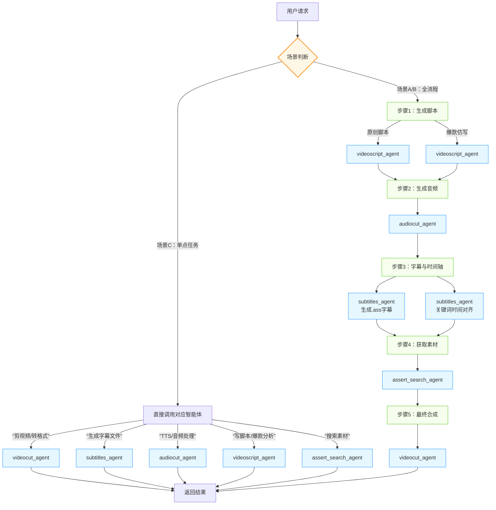

```mermaid
graph TD
    A[用户请求] --> B{场景判断}
    B -->|场景C：单点任务| C[直接调用对应智能体]
    C -->|“剪视频/转格式”| D[videocut_agent]
    C -->|“生成字幕文件”| E[subtitles_agent]
    C -->|“TTS/音频处理”| F[audiocut_agent]
    C -->|“写脚本/爆款分析”| G[videoscript_agent]
    C -->|“搜索素材”| H[assert_search_agent]
    D & E & F & G & H --> Z[返回结果]

    B -->|场景A/B：全流程| I[步骤1：生成脚本]
    I -->|原创脚本| I1[videoscript_agent]
    I -->|爆款仿写| I2[videoscript_agent]
    I1 & I2 --> J[步骤2：生成音频]
    J --> K[audiocut_agent]
    K --> L[步骤3：字幕与时间轴]
    L --> M1[subtitles_agent\n生成.ass字幕]
    L --> M2[subtitles_agent\n关键词时间对齐]
    M1 & M2 --> N[步骤4：获取素材]
    N --> O[assert_search_agent]
    O --> P[步骤5：最终合成]
    P --> Q[videocut_agent]
    Q --> Z

    classDef agent fill:#e6f7ff,stroke:#1890ff;
    classDef step fill:#f6ffed,stroke:#52c41a;
    classDef decision fill:#fff7e6,stroke:#fa8c16,stroke-width:2px;
    class I,J,L,N,P step;
    class B decision;
    class D,E,F,G,H,I1,I2,K,M1,M2,O,Q agent;
```